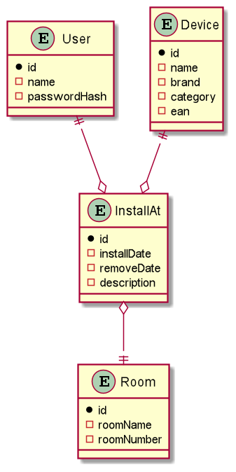
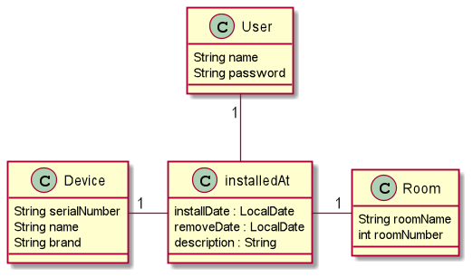
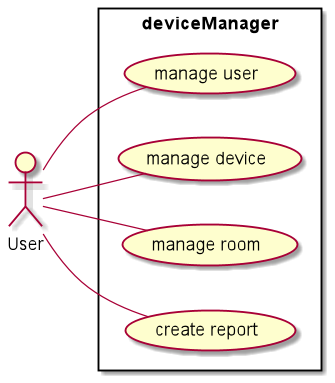

# 5ahif-syp-chromecast-manager
 
## Description 
A Device Manager for our school has to be implemented.

Many Devices should be registered in our school, and each of this devices is in a Class

## User Stories

* As a User i want to manage Devices.
* As a User i want to manage Users.
* As a User i want to manage Rooms.

## Data Model

### 1.ERD
asciidoctor-docker-template-master/images/cld.png

### 2.CLD

### 3.UCD

### Slides
[Device-Manager-Slides](https://paatz.github.io/device-manager-slides/slides/demo.html#/)

### Live-Presentation
[Live-Presentation 30:40](https://www.youtube.com/watch?v=-oZP3VJ7W_c&t=30m40s)

### Youtrack
[Youtrack](https://vm81.htl-leonding.ac.at/agiles/99-275/current)
